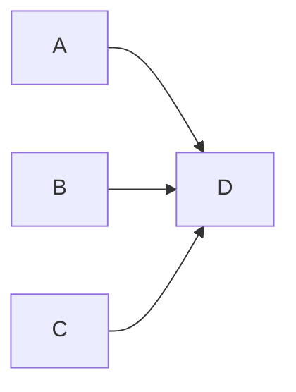
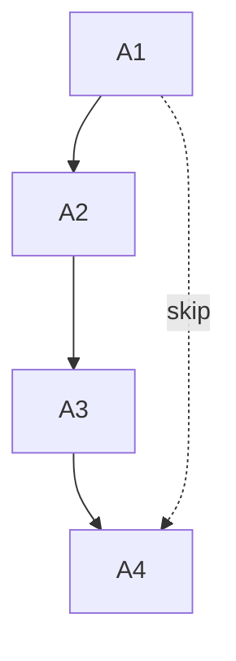
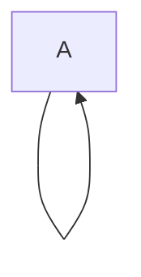
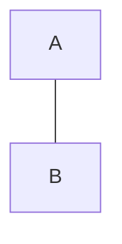
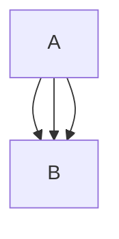
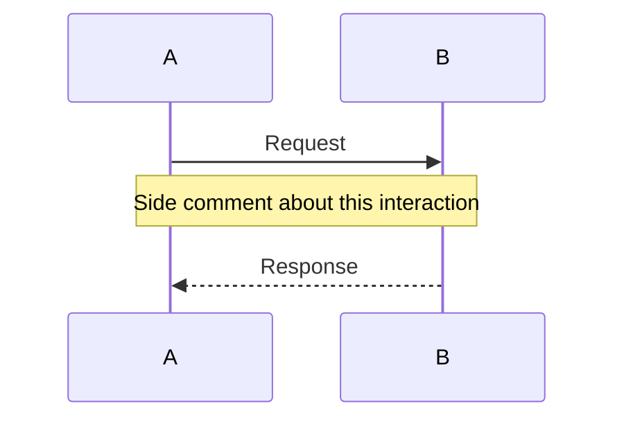
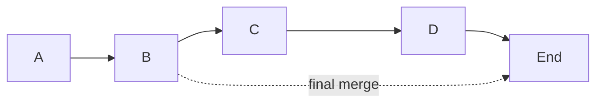

# Mermaid.js — Examples with Analogous Arrow Problems

**Date:** 2026-04-22
**Purpose:** Cho ví dụ Mermaid diagrams có vấn đề arrow routing **giống** `emit_arrow_svg` của Scriba, để so sánh cách tiếp cận.

Key insight: **Mermaid gần như KHÔNG gặp 3 vấn đề chính của chúng ta** (obstacle, nudge direction, same-column collapse) vì Mermaid dùng **layered layout** (dagre) — layout tự động reserve space cho edges. Scriba có **fixed grid** (DP table) nên annotation arrows phải route **qua/vượt** cells đã đặt → problem nặng hơn.

Dưới đây là các Mermaid snippet tái tạo **scenario tương tự**, kèm phân tích Mermaid xử lý ra sao.

---

## Scenario 1 — Multiple arrows converging on same target (stagger problem)

**Scriba case:** `dp_optimization.html` line 100-101, hai `\annotate` cùng target `dp[0][6]` từ `dp[0][3]` và `dp[4][6]`.

**Mermaid analog:**



**How Mermaid handles it:**

Mermaid dùng **dagre layered layout** — 3 source nodes được đặt ở rank 0 (cột trái), target D ở rank 1 (cột phải). Edges route qua inter-rank channel, mỗi edge có **waypoints** do dagre compute, rồi `edges.js:insertEdge` vẽ qua `lineFunction = line().x(x).y(y).curve(curveBasis)` — cubic Bezier đi qua waypoints.

Không có stagger **thủ công**. Stagger xảy ra **tự nhiên** vì dagre đặt 3 source nodes ở y khác nhau → 3 curves có slope khác nhau, chúng tự tách ra ở endpoint gần D.

Code quyết định shape — `edges.js:610-653`:

```js
let curve = curveLinear;
switch (edgeCurveType) {
    case 'linear':      curve = curveLinear; break;
    case 'basis':       curve = curveBasis; break;
    case 'cardinal':    curve = curveCardinal; break;
    case 'bumpX':       curve = curveBumpX; break;
    case 'bumpY':       curve = curveBumpY; break;
    case 'catmullRom':  curve = curveCatmullRom; break;
    case 'monotoneX':   curve = curveMonotoneX; break;
    case 'monotoneY':   curve = curveMonotoneY; break;
    case 'natural':     curve = curveNatural; break;
    case 'step':        curve = curveStep; break;
    case 'stepAfter':   curve = curveStepAfter; break;
    case 'stepBefore':  curve = curveStepBefore; break;
    case 'rounded':     curve = curveLinear; break;
    default:            curve = curveBasis;
}
const { x, y } = getLineFunctionsWithOffset(edge);
const lineFunction = line().x(x).y(y).curve(curve);
```

**Scriba difference:** Chúng ta **không có** layout pass — cells đã fix trên grid, không thể đẩy source apart. Buộc phải `arrow_index × stagger` thủ công trong `emit_arrow_svg:1812-1813`:

```python
stagger = cell_height * 0.3
total_offset = base_offset + min(arrow_index, 4) * stagger
```

---

## Scenario 2 — Arrow skipping through intermediate nodes (obstacle problem)

**Scriba case:** `\annotate{dp[0][6]}{arrow_from=dp[4][6]}` — arrow dọc cùng cột 6 phải vượt qua `dp[1][6]`, `dp[2][6]`, `dp[3][6]`.

**Mermaid analog:**



Arrow dashed từ A1 "skip" xuống A4, theo đường dọc đi qua A2, A3.

**How Mermaid handles it:**

Dagre layer A1-A2-A3-A4 thành 4 ranks riêng biệt (vertical layout). Edge `A1 -.-> A4` được đặt vào **parallel lane** bên cạnh cột chính, không xuyên qua A2/A3 vì **dagre bundling** đẩy edges ra kênh riêng:

```js
// Mermaid không có obstacle avoidance code nào — dựa hoàn toàn vào dagre
// để đặt waypoints, rồi edges.js chỉ render spline qua chúng.
// See edges.js:602: let lineData = points.filter((p) => !Number.isNaN(p.y));
```

Dagre tính waypoints (points array) theo thuật toán Sugiyama framework — edge dài được thêm **dummy nodes** ở mỗi rank trung gian, tạo thành polyline. Rồi curveBasis interpolate smooth qua dummy nodes → S-curve nhẹ tránh A2/A3.

**Scriba difference:** Chúng ta không có dagre, không có dummy nodes. `emit_arrow_svg` chỉ có 2 control points cubic Bezier → không thể tạo S-curve tránh obstacles. Phase D (v0.13.1) trong roadmap mới đề xuất greedy nudge up — nhưng đó vẫn là **single arch**, không phải waypoint polyline.

---

## Scenario 3 — Same-column/same-row vertical collapse

**Scriba case:** `h_span < 4` edge case trong `emit_arrow_svg:1841` — source và target cùng cột → default formula cho control points trùng x → curve collapse thành line thẳng.

**Mermaid analog:**



Self-loop — source = target. Mermaid đặc biệt render self-loops như **full circle/ellipse**, không dùng same formula như thường edges.



Hai nodes thẳng hàng dọc, edge nối. Mermaid route qua inter-node space (không có nodes ở giữa) — curveBasis vẫn cong rất nhẹ giữa 2 endpoints vì dagre cho gap đủ lớn.

Nếu có **multiple edges** cùng src/dst:



Mermaid render 3 edges **overlap** — không có auto-separation cho parallel edges. Đây là **known limitation** của Mermaid (tham khảo [mermaid-js/mermaid#1213](https://github.com/mermaid-js/mermaid/issues/1213)).

**Scriba difference:** Chúng ta giải quyết chính xác case này với `h_nudge`:

```python
# _svg_helpers.py:1841-1846
h_span = abs(x2 - x1)
if h_span < 4:
    h_nudge = total_offset * 0.6
    cx1 = max(0, int(mid_x_f - h_nudge))  # Phase B sẽ fix direction
    cy1 = mid_y_val
    cx2 = max(0, int(mid_x_f - h_nudge))
    cy2 = mid_y_val
```

→ Scriba **better** than Mermaid ở case này vì Mermaid không handle parallel same-endpoint edges.

---

## Scenario 4 — Annotation note with leader line

**Scriba case:** Annotation pill với label, leader line khi pill bị đẩy xa khỏi anchor (R-27b).

**Mermaid analog — sequence diagram note:**



`Note over A,B` là annotation — rendered thành một box vàng stretched giữa 2 participants. Không có leader line — note **nằm inline** giữa 2 message arrows.

**Mermaid equivalent closer to annotation pill:**



Edge label `"final merge"` gắn vào edge B→E. Mermaid đặt label ở midpoint của spline — code `edges.js:245-273`:

```js
export const positionEdgeLabel = (edge, paths) => {
  let path = paths.updatedPath ? paths.updatedPath : paths.originalPath;
  if (edge.label) {
    const el = edgeLabels.get(edge.id);
    let x = edge.x;
    let y = edge.y;
    if (path) {
      const pos = utils.calcLabelPosition(path);  // ← t=0.5 equivalent
      if (paths.updatedPath) {
        x = pos.x;
        y = pos.y;
      }
    }
    el.attr('transform', `translate(${x}, ${y + subGraphTitleTotalMargin / 2})`);
  }
  // ...
};
```

`utils.calcLabelPosition(path)` iterates `path.getTotalLength()` chia đôi → traverse `path.getPointAtLength(len/2)` lấy midpoint. **Giống y hệt** Scriba B(0.5) anchor.

**Scriba difference:** Scriba có **smart-label engine** đẩy pill ra khỏi anchor nếu bị occlusion, kèm **leader line** khi displacement lớn. Mermaid không có — label luôn ở midpoint, đè lên edge nếu edge cong qua chỗ label.

---

## Scenario 5 — Edge passing through node boundary (intersection)

**Mermaid giải quyết điểm cuối mũi tên tại biên node** — đây là phần code **tương đương** với smart-label scoring của chúng ta:

`edges.js:335-398` — `intersection()`:

```js
export const intersection = (node, outsidePoint, insidePoint) => {
  const x = node.x;
  const y = node.y;
  const dx = Math.abs(x - insidePoint.x);
  const w = node.width / 2;
  let r = insidePoint.x < outsidePoint.x ? w - dx : w + dx;
  const h = node.height / 2;
  const Q = Math.abs(outsidePoint.y - insidePoint.y);
  const R = Math.abs(outsidePoint.x - insidePoint.x);

  if (Math.abs(y - outsidePoint.y) * w > Math.abs(x - outsidePoint.x) * h) {
    // Intersection is top or bottom of rect.
    let q = insidePoint.y < outsidePoint.y ? outsidePoint.y - h - y : y - h - outsidePoint.y;
    r = (R * q) / Q;
    return {
      x: insidePoint.x < outsidePoint.x ? insidePoint.x + r : insidePoint.x - R + r,
      y: insidePoint.y < outsidePoint.y ? insidePoint.y + Q - q : insidePoint.y - Q + q,
    };
  } else {
    // Intersection on sides of rect
    // ... (similar logic)
  }
};
```

Hàm này tính **điểm cắt** giữa line segment và AABB của node, để arrow không đâm vào giữa node mà dừng ở biên.

Scriba `emit_arrow_svg` có `shorten_src` / `shorten_dst` parameters làm điều tương tự — rút ngắn endpoint:

```python
# _svg_helpers.py:1795-1802
if shorten_dst > 0 and dist > 0:
    x2 = x2 - (dx / dist) * shorten_dst
    y2 = y2 - (dy / dist) * shorten_dst
```

→ Scriba dùng **distance-based shorten** (simpler). Mermaid dùng **AABB ray intersection** (precise hơn cho rectangular nodes). Cách Mermaid tốt hơn khi nodes có width/height rất khác nhau (DPTable cells đều nhau nên Scriba OK).

---

## Scenario 6 — Path-clipping through cluster (obstacle awareness thô sơ)

`edges.js:400-434` — `cutPathAtIntersect()`:

```js
const cutPathAtIntersect = (_points, boundaryNode) => {
  let points = [];
  let lastPointOutside = _points[0];
  let isInside = false;
  _points.forEach((point) => {
    if (!outsideNode(boundaryNode, point) && !isInside) {
      const inter = intersection(boundaryNode, lastPointOutside, point);
      if (!points.some((e) => e.x === inter.x && e.y === inter.y)) {
        points.push(inter);
      }
      isInside = true;
    } else {
      lastPointOutside = point;
      if (!isInside) {
        points.push(point);
      }
    }
  });
  return points;
};
```

Đây là form **obstacle awareness** thô của Mermaid — edge đi vào cluster boundary thì cắt, không vẽ segment bên trong. **Không phải** full obstacle avoidance — chỉ clip khi đi vào cluster (giống Scriba clip arrow ở viewport edge).

**Scriba difference:** Chúng ta không có cluster concept, nhưng Phase D (v0.13.1) sẽ cần similar logic — sample Bezier 8 points, check AABB intersection, push offset up nếu có.

---

## Scenario 7 — Orthogonal/rounded corners (alternative shape)

Mermaid support **rounded path mode** — `edges.js:837-909`:

```js
function generateRoundedPath(points, radius) {
  if (points.length < 2) return '';
  let path = '';
  const size = points.length;
  const epsilon = 1e-5;

  for (let i = 0; i < size; i++) {
    const currPoint = points[i];
    const prevPoint = points[i - 1];
    const nextPoint = points[i + 1];

    if (i === 0) {
      path += `M${currPoint.x},${currPoint.y}`;
    } else if (i === size - 1) {
      path += `L${currPoint.x},${currPoint.y}`;
    } else {
      // Calculate vectors for incoming and outgoing segments
      const dx1 = currPoint.x - prevPoint.x;
      const dy1 = currPoint.y - prevPoint.y;
      const dx2 = nextPoint.x - currPoint.x;
      const dy2 = nextPoint.y - currPoint.y;

      const len1 = Math.hypot(dx1, dy1);
      const len2 = Math.hypot(dx2, dy2);

      if (len1 < epsilon || len2 < epsilon) {
        path += `L${currPoint.x},${currPoint.y}`;
        continue;
      }

      // Normalize vectors
      const nx1 = dx1 / len1, ny1 = dy1 / len1;
      const nx2 = dx2 / len2, ny2 = dy2 / len2;

      // Angle between vectors
      const dot = nx1 * nx2 + ny1 * ny2;
      const clampedDot = Math.max(-1, Math.min(1, dot));
      const angle = Math.acos(clampedDot);

      if (angle < epsilon || Math.abs(Math.PI - angle) < epsilon) {
        path += `L${currPoint.x},${currPoint.y}`;
        continue;
      }

      // Distance to offset the control point
      const cutLen = Math.min(radius / Math.sin(angle / 2), len1 / 2, len2 / 2);

      // Start and end points of the curve
      const startX = currPoint.x - nx1 * cutLen;
      const startY = currPoint.y - ny1 * cutLen;
      const endX = currPoint.x + nx2 * cutLen;
      const endY = currPoint.y + ny2 * cutLen;

      path += `L${startX},${startY}`;
      // Draw the quadratic Bezier curve at the corner
      path += `Q${currPoint.x},${currPoint.y} ${endX},${endY}`;
    }
  }
  return path;
}
```

**Kỹ thuật:** với mỗi corner trong polyline, cắt `cutLen` dọc incoming/outgoing segment, đặt quadratic Bezier curve tại corner với control point = corner point. `cutLen` dựa angle: `radius / sin(angle/2)` — công thức hình học chuẩn cho "fillet" corner.

Đây là **orthogonal routing với fillet corners** — giống React Flow `smoothstep`, Excalidraw elbow arrows.

**Scriba difference:** Chúng ta **không support** orthogonal layout. Nếu muốn Phase E thêm orthogonal mode, công thức này chính là template — 35 lines Python.

---

## Scenario 8 — Corner detection (pre-processing)

`edges.js:436-462` — `extractCornerPoints`:

```js
function extractCornerPoints(points) {
  const cornerPoints = [];
  const cornerPointPositions = [];
  for (let i = 1; i < points.length - 1; i++) {
    const prev = points[i - 1];
    const curr = points[i];
    const next = points[i + 1];
    if (
      prev.x === curr.x &&
      curr.y === next.y &&
      Math.abs(curr.x - next.x) > 5 &&
      Math.abs(curr.y - prev.y) > 5
    ) {
      cornerPoints.push(curr);
      cornerPointPositions.push(i);
    } else if (
      prev.y === curr.y &&
      curr.x === next.x &&
      Math.abs(curr.x - prev.x) > 5 &&
      Math.abs(curr.y - next.y) > 5
    ) {
      cornerPoints.push(curr);
      cornerPointPositions.push(i);
    }
  }
  return { cornerPoints, cornerPointPositions };
}
```

Detect waypoints nào là **right-angle corners** (prev/curr cùng x, curr/next cùng y → L-turn). Dùng cho `fixCorners()` để pre-round.

---

## Tóm tắt so sánh

| Problem | Mermaid solution | Scriba solution | Winner |
|---------|-----------------|----------------|--------|
| Multiple arrows same target | Layout spreads sources (dagre) | Manual `arrow_index × stagger` | **Mermaid** (auto) |
| Skip-edge through obstacles | Dummy nodes + dagre channel | Arch up cố định (no obstacle) | **Mermaid** (dagre does heavy lifting) |
| Same-column collapse | **Doesn't handle** (parallel edges overlap) | `h_nudge` sideways | **Scriba** |
| Annotation leader line | No leader — label inline | Smart-label + leader when far | **Scriba** |
| Endpoint on node boundary | AABB ray intersection | Distance-based shorten | **Mermaid** (precise) |
| Orthogonal routing | `generateRoundedPath` + `fixCorners` | Not supported | **Mermaid** |
| Curve shape variety | 13 D3 curve families | Single cubic Bezier | **Mermaid** |

## Key takeaways cho Scriba

1. **Mermaid gần như không gặp obstacle/nudge problems** vì dùng dagre layout. Scriba không thể copy approach này — grid đã fixed.
2. **`intersection()` ray-cast** — có thể adopt thay `shorten_dst` distance-based, precise hơn cho rectangular cells. Effort S (~30 lines Python).
3. **`generateRoundedPath` + `fixCorners`** — template cho Phase E orthogonal mode (nếu sau này cần). Sẵn sàng port.
4. **`extractCornerPoints`** — heuristic cho "is this a corner waypoint" — useful nếu Scriba dần chuyển sang polyline routing.
5. **`calcLabelPosition(path)`** (gọi trong `positionEdgeLabel`) — dùng `getPointAtLength(len/2)` SVG native API. Tương đương B(0.5) nhưng walks the **actual rendered path**, không phải analytical formula → precise hơn cho catmullRom / natural curves (nhiều CPs).

## Source citation

- Repo: [mermaid-js/mermaid](https://github.com/mermaid-js/mermaid)
- File: `packages/mermaid/src/rendering-util/rendering-elements/edges.js`
- SHA: `6855a43da52a4cb666bd884222d636eea0eb96cc`
- Fetched: 2026-04-22
- Line count: 961

### Related

- [dagre-d3](https://github.com/dagrejs/dagre-d3) — layered layout engine used by Mermaid
- [d3-shape curve factories](https://github.com/d3/d3-shape#curves) — curveBasis/Cardinal/etc. implementations
- [Wybrow, Marriott, Stuckey (2009)](https://doi.org/10.1109/TVCG.2009.170) — "Orthogonal Connector Routing" (for full-featured obstacle avoidance)
