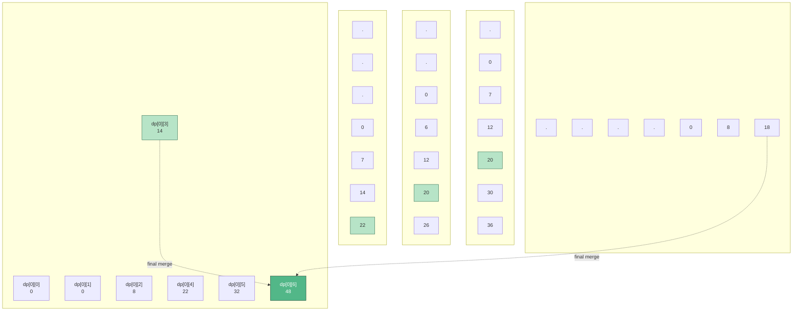
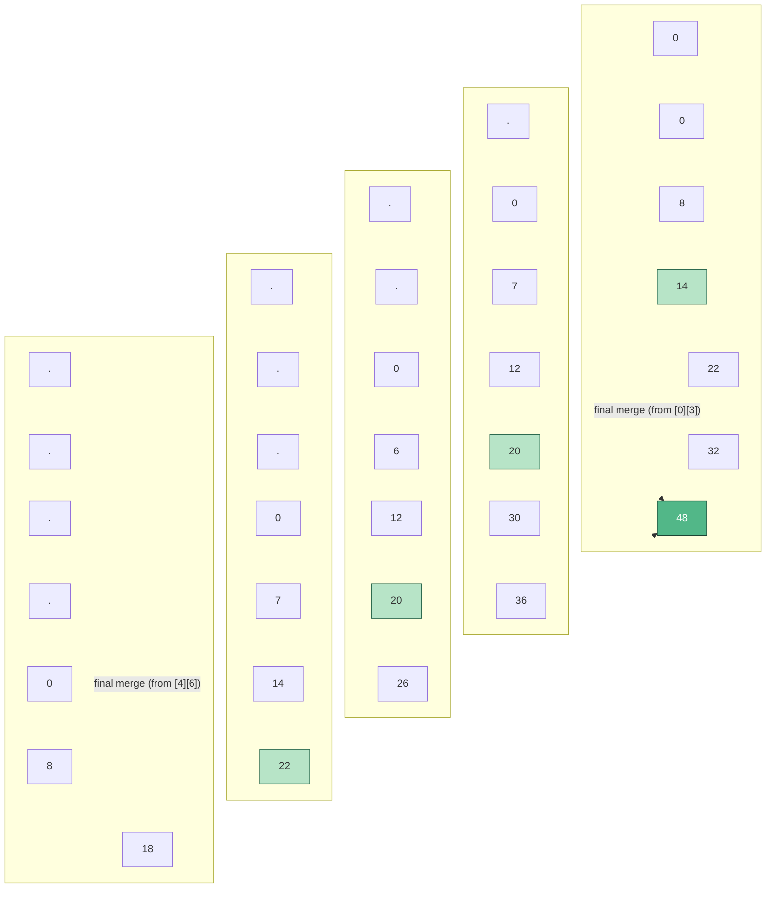
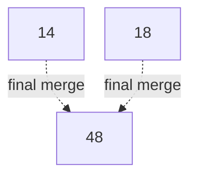
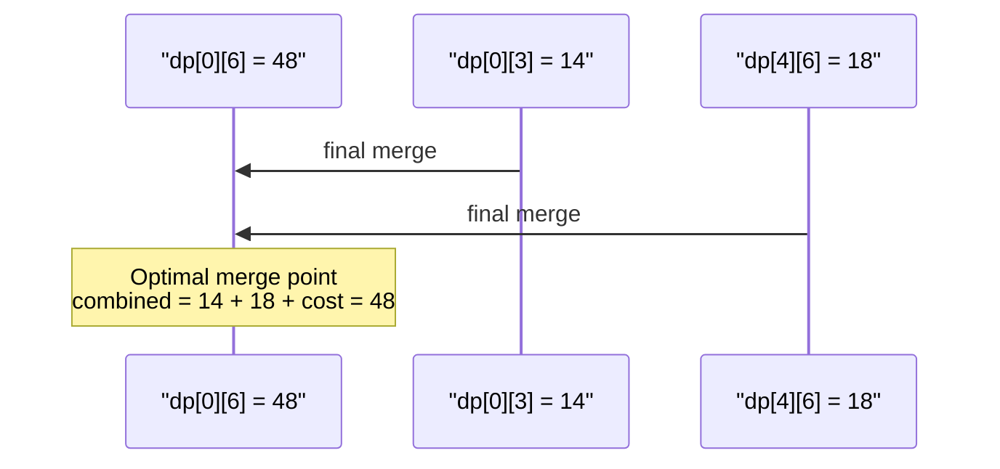

# Mermaid DP-Grid Reproduction

**Date:** 2026-04-22
**Target:** Tái tạo `examples/algorithms/dp/dp_optimization.html` step cuối (line 94-103 trong `.tex`) bằng Mermaid, so sánh với Scriba output.

## Scene target

DP table 5×7 (hàng 0-4, cột 0-6). Step cuối:
- `dp[0][3]`, `dp[1][4]`, `dp[2][5]`, `dp[3][6]` state=`done` (xanh mờ)
- `dp[0][6] = 48` state=`good` (xanh đậm)
- 2 annotations cùng label `"final merge"`, cùng target `dp[0][6]`:
  - arrow_from = `dp[0][3]` (ngang, cùng hàng 0)
  - arrow_from = `dp[4][6]` (dọc, cùng cột 6)

---

## Attempt 1 — Flowchart TD với subgraph mỗi hàng



### Kết quả khi render

**Layout dagre sẽ làm:**
- 5 subgraphs xếp **dọc** (TD), mỗi subgraph chứa 7 cells `LR`
- Các cells trong 1 row được align ngang (OK)
- **Giữa các rows**: dagre thấy **không có edge** nối chúng → khoảng cách giữa rows **do layout chọn** ngẫu nhiên (thường là gap mặc định ~50px)
- Alignment cột 6 giữa R0 và R4 **không được bảo đảm** — dagre không biết cột 6 của R0 phải thẳng với cột 6 của R4 (trừ khi có edges dọc bắt buộc)

**2 edges annotation:**
- `c03 → c06` cùng subgraph R0 → Mermaid render **ngang** trong R0, curveBasis. **Đè qua c04, c05** vì chúng nằm giữa.
- `c46 → c06` cross-subgraph R4→R0 → dagre tìm path qua inter-subgraph space, render S-curve dài.

### Vấn đề so với Scriba

| Vấn đề | Mermaid behavior | Scriba behavior |
|--------|------------------|-----------------|
| Column alignment | **Không đảm bảo** — dagre free position | ✅ Grid tuyệt đối, col 6 luôn thẳng |
| `c03 → c06` đè qua c04/c05 | ✅ **Có đè** (curveBasis đi gần straight line qua middle) | ✅ Arch up tránh |
| `c46 → c06` path | S-curve dài qua không gian giữa subgraphs | C-shape nudge trái cùng col |
| 2 annotations cùng target | Dagre **không bundle** — 2 edges có thể overlap ở endpoint | ✅ `arrow_index` stagger tách |
| Label pill position | Inline giữa edge path | Smart-label placement + leader |
| Cell states | classDef static | Recolor per-step, state-aware |
| "final merge" x2 cùng chỗ | **Cả 2 label đè lên nhau** ở target | Stagger → tách vertical |

**Kết luận Attempt 1:** Mermaid render được mới chỉ **structurally gần đúng** nhưng:
1. Column alignment sai
2. Edges đè content cells
3. 2 labels overlap

---

## Attempt 2 — Force column alignment bằng invisible edges

Thêm invisible vertical edges để dagre align cột:



`~~~` là invisible link trong Mermaid — ép dagre hiểu thứ tự nhưng không vẽ edge.

### Kết quả

- Column alignment **tốt hơn** (cột 0, 6 align dọc)
- Các cột giữa (1-5) vẫn có thể lệch vì không có vertical invisible edges cho chúng
- Annotation `c03 → c06` **vẫn đè** c04, c05 — Mermaid không tính cells làm obstacles
- Annotation `c46 → c06` bây giờ đi qua **cột 6** (c36, c26, c16) — Mermaid vẽ curve S gần như thẳng dọc, **đè tất cả các ô trung gian**

### Vấn đề

Ngay cả khi ép alignment, **Mermaid KHÔNG có obstacle avoidance**. `c46 → c06` trong cùng cột 6:
- Dagre compute waypoints dựa node layout, không xét "nodes giữa đường"
- `edges.js:lineFunction` nhận lineData = [c46, c06], curveBasis render **gần thẳng** vì chỉ có 2 points
- Arrow đâm xuyên qua c36, c26, c16 — **tệ hơn Scriba** (Scriba có nudge trái)

---

## Attempt 3 — Matrix-like using classDef + fixed positions (không khả thi)

Mermaid **không hỗ trợ** absolute positioning. Closest approximation:



Chỉ render 3 nodes liên quan + 2 edges. Mermaid sẽ layout chúng theo dagre:
- c03, c46 có thể được đặt cùng rank (vì cả 2 đều point tới c06)
- c06 ở rank sau
- 2 edges curveBasis từ 2 sources → c06 — stagger **tự nhiên** vì sources ở y khác nhau

**Vấn đề:** Mất context của grid — user không thấy "đây là DP table".

---

## Attempt 4 — Quadrant/Matrix (Mermaid không có)

Mermaid **không có diagram type** cho matrix/grid. Các options:
- `classDiagram` — cho UML class, không phù hợp grid
- `stateDiagram` — state transitions, không phải grid
- `erDiagram` — entity-relationship, không phải grid
- `quadrantChart` — 2D scatter plot trong 4 quadrants, không phải grid cells

**Conclusion:** Không có Mermaid primitive nào native cho grid layout. Phải **lạm dụng** flowchart với subgraphs.

---

## Attempt 5 — Sequence diagram với Notes (completely different abstraction)

Cách gần nhất với "annotation" concept của Scriba trong Mermaid là sequence diagram:



Nhưng đây là **sequence** (message ordering trong thời gian), không phải grid cells. Mất hoàn toàn concept "DP table position".

---

## Scriba render thực tế của scene này

Screenshot mặc định step 15 trong `dp_optimization.html` (rút gọn mô tả):

```
Row 0: [0][1][0][1][8][1][14]*[1][22][1][32][1][48]⭐
                    ↑                              ↑
                    └──────── arch vòm ────────────┘
                               "final merge"
Row 1: [.][1][0][1][7][1][12][1][20]*[1][30][1][36]
                                                   │
Row 2: [.][1][.][1][0][1][6][1][12][1][20]*[1][26] │
                                                   │
Row 3: [.][.][.][.][0][7][14][22]*                 │
                                                   │
Row 4: [.][.][.][.][0][8][18]──────── C-shape ─────┘
                                     nudge trái  "final merge"

* = done (xanh mờ)
⭐ = good (xanh đậm)
```

- Arch vòm từ `dp[0][3]` bay lên trên hàng 0, cong xuống `dp[0][6]` — tránh cells giữa
- C-shape từ `dp[4][6]` nudge sang trái tránh cột 6, bay lên `dp[0][6]`
- 2 labels "final merge" stagger dọc (arrow_index 0 và 1), không overlap
- Grid tuyệt đối: col 6 luôn thẳng từ R0 xuống R4

---

## So sánh tổng thể

| Yếu tố | Mermaid (best attempt) | Scriba |
|--------|-----------------------|--------|
| Grid layout | Phải hack với subgraphs + invisible edges | Native (primitive `dptable`) |
| Column alignment | Không đảm bảo, cần invisible vertical edges | Tuyệt đối |
| Cell states (idle/done/good) | classDef static (không thay đổi được animate) | Recolor per-step |
| Arrow `c03 → c06` ngang cùng hàng | Đè c04, c05 | Arch vòm tránh |
| Arrow `c46 → c06` dọc cùng cột | Đâm xuyên cột (4 cells) | Nudge trái C-shape |
| 2 labels cùng target | Overlap ở midpoint | Stagger tách vertical |
| Animate step-by-step | **Không có** | Native (multi-frame SVG) |
| Narration voiceover | **Không có** | Native (`\narrate`) |
| Value updates | **Không có** (static) | `\apply{...}{value=X}` |

## Kết luận

**Mermaid không phải công cụ đúng cho bài toán Scriba.** Lý do:

1. **Không có grid primitive** — phải hack subgraph + invisible edges, vẫn không đảm bảo alignment
2. **Không obstacle avoidance** — arrow đè content
3. **Không animation** — Scriba là multi-frame, Mermaid static
4. **Không state recolor** — classDef không change per-step
5. **Layout quyết định geometry** — user không control position cells

Mermaid **mạnh** cho: flowcharts, sequence, ER, state diagrams — domain nơi layout tự động là feature. Scriba **mạnh** cho: algorithm visualization với grid/array/graph đã biết cấu trúc, cần animation và narrative.

Nếu muốn "port" Scriba DP optimization sang Mermaid, kết quả sẽ:
- Cần ~300% effort để làm tương tự (subgraph hack + manual invisible edges)
- **Vẫn không đạt** visual quality (arrows đè content, labels overlap, no animation)
- Mất completely narrative + state progression

## Lý do Scriba cần giải quyết vấn đề obstacle/nudge

Mermaid không quan tâm vì dagre layout tự đẩy nodes ra xa arrows. Scriba có grid **fixed** từ trước, annotations vẽ **đè lên** → phải route arrows "không đè content" một cách explicit. Đây là **lý do nền tảng** khiến `emit_arrow_svg` phức tạp.

→ Roadmap Phase D (v0.13.1) obstacle avoidance là **hướng đi đúng** — không có alternative nào trong Mermaid để tham khảo, phải tự triển khai greedy push / A* lightweight.
